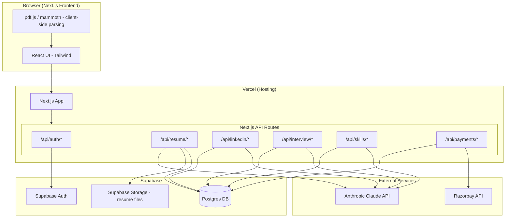
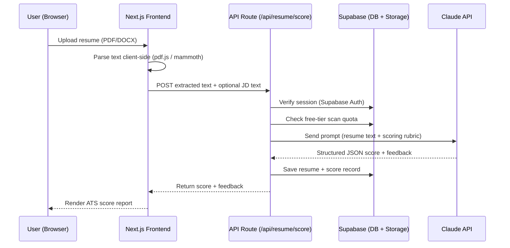
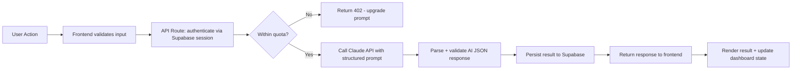

# ARCHITECTURE.md — AI Career Copilot

## 1. High-Level Component Diagram

## 2. Data Flow — Resume ATS Scoring (primary flow)

## 3. Request Lifecycle (general pattern for all AI features)

## 4. AI Interaction Design

- All AI calls are server-side only (API routes), never directly from the browser — this protects the Anthropic API key.
- Every AI prompt requests **structured JSON output** (score, feedback array, keywords array, etc.) so the frontend can render consistent UI without parsing free text.
- Model: **Claude Haiku 4.5** for all v1.0 features (cost-optimized). Escalation to a stronger model is a post-v1.0 consideration if feedback quality proves insufficient.
- Each AI call is logged (prompt type, token count, latency) in a lightweight `ai_usage_logs` table for cost monitoring.

## 5. External Services

| Service | Purpose | Free Tier Notes |
|---|---|---|
| Supabase | DB, Auth, File Storage | Free tier: 500MB DB, 1GB file storage, 50k MAUs |
| Anthropic Claude API | Resume scoring, LinkedIn feedback, interview Q&A, skill gap analysis | Pay-per-token — monitor via `ai_usage_logs` |
| Razorpay | INR payments/subscriptions | Free integration, transaction fees only |
| Vercel | Hosting, CI/CD | Free tier sufficient for v1.0 traffic |

## 6. Security Notes
- Supabase Row Level Security (RLS) enabled on all tables — users can only read/write their own rows.
- Anthropic and Razorpay API keys stored as Vercel environment variables, never exposed to the client.
- File uploads restricted to PDF/DOCX, size-capped (e.g., 5MB), scanned for type before parsing.
