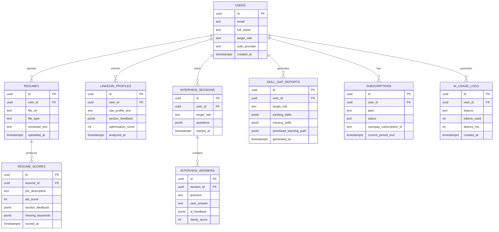

# SCHEMA.md — AI Career Copilot Database Design (Supabase / Postgres)

## Entity Relationship Overview

## Table Definitions

### `users`
| Field | Type | Constraints |
|---|---|---|
| id | uuid | PK, default `auth.uid()` (linked to Supabase Auth) |
| email | text | unique, not null |
| full_name | text | nullable |
| target_role | text | nullable — used to personalize skill-gap/interview features |
| auth_provider | text | 'email' \| 'google' |
| created_at | timestamptz | default now() |

### `resumes`
| Field | Type | Constraints |
|---|---|---|
| id | uuid | PK |
| user_id | uuid | FK → users.id, not null |
| file_url | text | Supabase Storage path |
| file_type | text | 'pdf' \| 'docx' |
| extracted_text | text | parsed resume content |
| uploaded_at | timestamptz | default now() |

### `resume_scores`
| Field | Type | Constraints |
|---|---|---|
| id | uuid | PK |
| resume_id | uuid | FK → resumes.id, not null |
| job_description | text | nullable (null = general ATS score, not JD-matched) |
| ats_score | int | 0–100, not null |
| section_feedback | jsonb | array of {section, issue, suggestion} |
| missing_keywords | jsonb | array of strings, nullable |
| scored_at | timestamptz | default now() |

### `linkedin_profiles`
| Field | Type | Constraints |
|---|---|---|
| id | uuid | PK |
| user_id | uuid | FK → users.id, not null |
| raw_profile_text | text | not null |
| section_feedback | jsonb | array of {section, current, suggested} |
| optimization_score | int | 0–100 |
| analyzed_at | timestamptz | default now() |

### `interview_sessions`
| Field | Type | Constraints |
|---|---|---|
| id | uuid | PK |
| user_id | uuid | FK → users.id, not null |
| target_role | text | not null |
| questions | jsonb | array of generated question strings |
| started_at | timestamptz | default now() |

### `interview_answers`
| Field | Type | Constraints |
|---|---|---|
| id | uuid | PK |
| session_id | uuid | FK → interview_sessions.id, not null |
| question | text | not null |
| user_answer | text | not null |
| ai_feedback | jsonb | {strengths, improvements, suggested_answer} |
| clarity_score | int | 0–100, nullable |

### `skill_gap_reports`
| Field | Type | Constraints |
|---|---|---|
| id | uuid | PK |
| user_id | uuid | FK → users.id, not null |
| target_role | text | not null |
| existing_skills | jsonb | array of strings |
| missing_skills | jsonb | array of strings |
| prioritized_learning_path | jsonb | ordered array of {skill, why, resource_hint} |
| generated_at | timestamptz | default now() |

### `subscriptions`
| Field | Type | Constraints |
|---|---|---|
| id | uuid | PK |
| user_id | uuid | FK → users.id, not null, unique (one active plan per user) |
| plan | text | 'free' \| 'pro_monthly' \| 'pro_annual' |
| status | text | 'active' \| 'past_due' \| 'cancelled' |
| razorpay_subscription_id | text | nullable |
| current_period_end | timestamptz | nullable |

### `ai_usage_logs`
| Field | Type | Constraints |
|---|---|---|
| id | uuid | PK |
| user_id | uuid | FK → users.id, not null |
| feature | text | 'resume_score' \| 'linkedin' \| 'interview' \| 'skill_gap' |
| tokens_used | int | not null |
| latency_ms | int | nullable |
| created_at | timestamptz | default now() |

## Row Level Security (RLS)
All tables have RLS enabled with a standard policy: `user_id = auth.uid()` (or, for `resume_scores`/`interview_answers`, joined through the parent `resume_id`/`session_id` ownership) for `SELECT`, `INSERT`, `UPDATE`, `DELETE`.

## Validation Against PRD User Stories
| User Story | Supported By |
|---|---|
| Sign up email/Google | `users`, `auth_provider` |
| Upload resume + ATS score | `resumes`, `resume_scores` |
| JD match + missing keywords | `resume_scores.job_description`, `.missing_keywords` |
| LinkedIn rewrite suggestions | `linkedin_profiles` |
| Interview questions + feedback | `interview_sessions`, `interview_answers` |
| Skill gap prioritized list | `skill_gap_reports` |
| Score history over time | `resume_scores.scored_at` (multiple rows per user via `resumes`) |
| INR upgrade | `subscriptions` |
| Dashboard "what's next" | Derived from most recent rows across all tables (no dedicated table needed) |

All nine PRD user stories map to at least one table — no gaps found.
