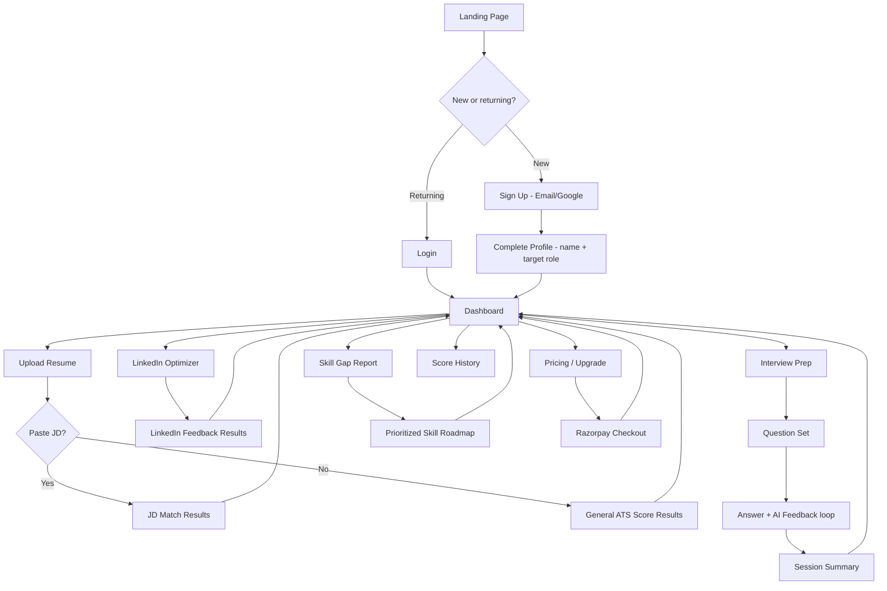

# UI-WIREFRAMES.md — AI Career Copilot

## 1. User Flow Diagram



## 2. Screen Flow (v1.0 screen inventory)

| # | Screen | Purpose | Reachable From |
|---|---|---|---|
| 1 | Landing Page | Marketing/value prop, CTA to sign up | Entry point |
| 2 | Sign Up | Create account (email or Google) | Landing |
| 3 | Login | Return access | Landing |
| 4 | Profile Setup | Capture name + target role (used to personalize AI features) | Post-signup, once |
| 5 | Dashboard | Central hub: latest scores, quota, next action | Post-login, always |
| 6 | Resume Upload | Upload + optional JD paste | Dashboard |
| 7 | ATS/JD Score Result | Score + section feedback + keywords | After scoring |
| 8 | LinkedIn Optimizer | Paste profile sections | Dashboard |
| 9 | LinkedIn Result | Section-by-section rewrite suggestions | After analysis |
| 10 | Interview Prep Setup | Choose/confirm target role | Dashboard |
| 11 | Interview Q&A | One question at a time, typed answer, immediate AI feedback | After setup |
| 12 | Interview Summary | Session recap, clarity scores | After all Qs answered |
| 13 | Skill Gap Report | Existing vs. missing skills, prioritized roadmap | Dashboard |
| 14 | Score History | Timeline of all past scans across features | Dashboard |
| 15 | Pricing / Upgrade | Plan comparison, INR pricing | Dashboard, or triggered by quota block |
| 16 | Checkout | Razorpay payment flow | Pricing page |
| 17 | Account Settings | Update profile, manage subscription, logout | Dashboard nav |

Every screen exists to serve exactly one PRD user story or a necessary supporting step (auth, checkout) — no screen was added without a corresponding story.

## 3. Low-Fidelity Wireframes (described)

### Dashboard
```
┌─────────────────────────────────────────────┐
│ [Logo]        Dashboard  History  Pricing  ⚙ │
├─────────────────────────────────────────────┤
│  Welcome back, {name}          Plan: Free    │
│                                 Scans left: 2 │
├───────────────┬───────────────┬─────────────┤
│ Resume Score   │ LinkedIn Score │ Skill Gaps  │
│   78/100       │    64/100      │  4 missing  │
│ [View] [Rescan]│ [View][Rescan] │  [View]     │
├───────────────┴───────────────┴─────────────┤
│  Recommended Next Action:                    │
│  "Your resume is missing 'REST APIs' —       │
│   run a JD match to confirm."  [Do it →]     │
├───────────────────────────────────────────────┤
│  [Upload Resume] [Optimize LinkedIn]         │
│  [Practice Interview] [Check Skill Gaps]     │
└─────────────────────────────────────────────┘
```

### Resume Upload + Score Result
```
┌─────────────────────────────────────────────┐
│  Upload Your Resume                          │
│  ┌───────────────────────────────┐           │
│  │  Drag & drop PDF/DOCX or       │           │
│  │  [Browse Files]                │           │
│  └───────────────────────────────┘           │
│  Paste a Job Description (optional):         │
│  ┌───────────────────────────────┐           │
│  │                                 │           │
│  └───────────────────────────────┘           │
│                     [Analyze My Resume →]    │
└─────────────────────────────────────────────┘

┌─────────────────────────────────────────────┐
│  ATS Score: 78/100          ●●●●●●●●○○       │
├─────────────────────────────────────────────┤
│  Missing Keywords: REST APIs, Docker, CI/CD  │
├─────────────────────────────────────────────┤
│  Section Feedback                            │
│  ▸ Summary — too generic, add metrics        │
│  ▸ Experience — good, add quantified impact  │
│  ▸ Skills — missing 3 JD-relevant keywords   │
└─────────────────────────────────────────────┘
```

### Interview Q&A
```
┌─────────────────────────────────────────────┐
│  Interview Prep — Target: SDE Intern         │
│  Question 3 of 8                             │
├─────────────────────────────────────────────┤
│  "Tell me about a time you debugged a        │
│   tricky issue under time pressure."         │
│                                               │
│  ┌───────────────────────────────┐           │
│  │ [Type your answer...]          │           │
│  └───────────────────────────────┘           │
│                        [Submit Answer →]     │
├───────────────────────────────────────────────┤
│  AI Feedback (after submit):                 │
│  ✓ Strength: Clear STAR structure            │
│  ✎ Improve: Quantify the impact               │
└─────────────────────────────────────────────┘
```

### Pricing Page
```
┌─────────────────────────────────────────────┐
│          Simple, Student-Friendly Pricing    │
├───────────────────┬───────────────────────────┤
│      Free          │        Pro (₹XXX/mo)     │
│  3 scans/month      │   Unlimited scans        │
│  Basic ATS score    │   Full interview prep    │
│                     │   Skill roadmap          │
│  [Current Plan]     │   [Upgrade Now →]        │
└───────────────────┴───────────────────────────┘
```

## 4. Navigation Structure
- **Top nav (persistent, post-login):** Dashboard | History | Pricing | Account (⚙)
- **Dashboard is always the "home base"** — every feature flow returns to it on completion.
- **Quota-blocked actions** redirect to Pricing with a contextual message rather than a dead-end error.
- **Mobile:** top nav collapses into a hamburger menu; dashboard cards stack vertically (single column).
